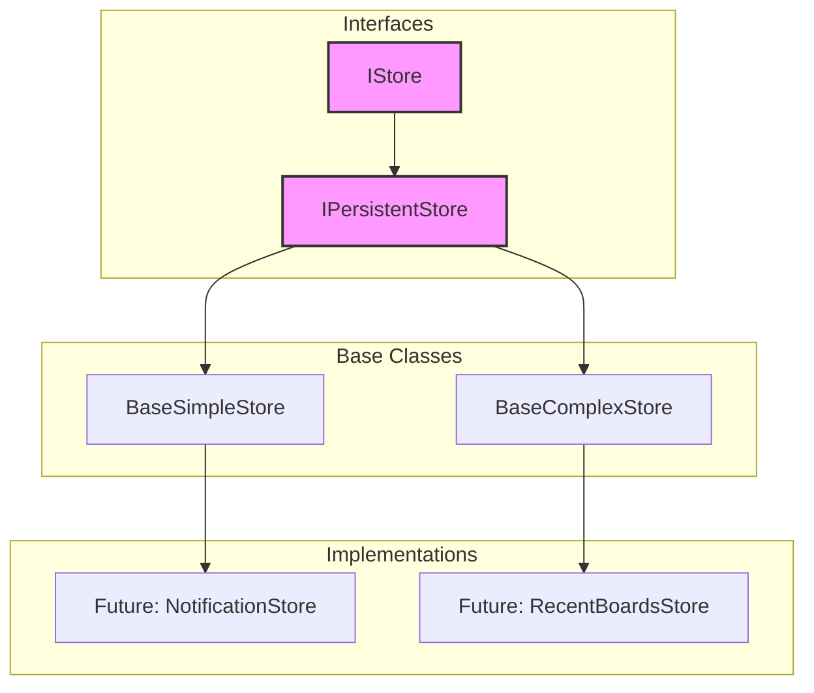

# Base Store Architecture (Zukunftskonzept)

**Version:** 2.0
**Datum:** 06. November 2025
**Status:** 🔮 **ZUKUNFTSKONZEPT** - NICHT für bestehende Stores verwenden!
**Zweck:** DRY-Abstraktion für zukünftige, einfache Stores mit `localStorage`-Anbindung.

---

## 🎯 Problem: Code-Duplikation in Stores

Aktuell haben mehrere Stores, die das "Manual `localStorage`"-Pattern nutzen, redundanten Code.

**Beispiel für Code-Duplikation:**
```typescript
// Diese ~30 Zeilen sind in JEDEM manuellen Store identisch:
private updateTrigger = $state(0);

private saveToStorage(): void {
    const key = this.getStorageKey();
    localStorage.setItem(key, JSON.stringify(this.getData()));
}

private triggerUpdate(): void {
    this.updateTrigger++;
    this.saveToStorage();
}

public clear(): void {
    const key = this.getStorageKey();
    localStorage.removeItem(key);
    this.updateTrigger++;
}
```
**Lösung:** Eine `BaseStore`-Klasse, die diese Logik kapselt und für zukünftige, einfache Stores wiederverwendbar ist.

---

## 🏗️ Architektur-Visualisierung



---

## 📜 Kritische Regeln für Entwickler

1.  **🔴 NICHTS REFAKTORISIEREN:** Bestehende Stores (`BoardStore`, `ChatStore`, `AuthStore`, `SettingsStore`) dürfen **NICHT** zu `BaseStore` migriert werden. Ihre Logik ist zu spezifisch.
2.  **✅ NUR FÜR NEUE STORES:** Das `BaseStore`-Pattern ist ausschließlich für **neue, einfache** Stores ab Phase 2.0 gedacht (z.B. `NotificationStore`).
3.  **⚖️ ABWÄGUNG TREFFEN:** Prüfe vor der Erstellung eines neuen Stores, ob die Komplexität eine eigene Implementierung rechtfertigt oder ob `BaseStore` ausreicht. Siehe [STORE-PATTERNS.md](../../GUIDES/STORE-PATTERNS.md).

---

## 🚫 Wann BaseStore NICHT verwenden (WICHTIG!)

`BaseStore` ist **ungeeignet** für die vier zentralen Stores des Projekts. Die Migration würde die Komplexität erhöhen und die Lesbarkeit verschlechtern.

| Store | Grund gegen Migration | Status |
|:---|:---|:---|
| **BoardStore** | Zu komplex: Multi-Board-Logik, Klassen-Rekonstruktion, Export/Import-API. | ❌ **NICHT migrieren** |
| **ChatStore** | Zu spezifisch: KI-Kontext-Aufbereitung, Memory-Ranking. | ❌ **NICHT migrieren** |
| **AuthStore** | Zu komplex: NDK-Integration, asynchrone Profil-Abfragen, Signer-Management. | ❌ **NICHT migrieren** |
| **SettingsStore** | Zu spezifisch: Asynchrones Laden von `config.json`, Merging-Logik. | ❌ **NICHT migrieren** |

**Fazit:** `BaseStore` ist eine Referenz für **zukünftige, einfache Stores**, kein Werkzeug für das Refactoring der bestehenden Architektur.

---

## 🛠️ Interface-Hierarchie

```typescript
// src/lib/stores/base/BaseStore.ts (Zukünftige Datei)

/**
 * Universelles Basis-Interface für alle Stores.
 */
export interface IStore {
	clear?(): void;
	reset?(): void;
}

/**
 * Interface für Stores, die in localStorage persistiert werden.
 */
export interface IPersistentStore<T> extends IStore {
	loadFromStorage(): T;
	saveToStorage(): void;
	getStorageKey(): string;
}
```

---

## 🧩 `BaseComplexStore<T>` - Für manuelle `localStorage`-Stores

Diese Klasse ist für Stores gedacht, die dynamische Keys oder komplexe Datenstrukturen (wie Klassen) verwalten.

```typescript
/**
 * Abstrakte Basisklasse für das "Manual localStorage"-Pattern.
 * Kapselt die triggerUpdate-Logik.
 *
 * Zukünftige Nutzung: RecentBoardsStore, etc.
 */
export abstract class BaseComplexStore<T> implements IPersistentStore<T> {
	protected updateTrigger = $state(0);

	// --- Abstrakte Methoden (Müssen von der Subklasse implementiert werden) ---
	protected abstract getStorageKey(): string;
	protected abstract getData(): T;
	protected abstract loadFromStorage(): T;

	// --- Geteilte Implementierung (DRY) ---
	protected saveToStorage(): void {
		try {
			const key = this.getStorageKey();
			const data = this.getData();
			localStorage.setItem(key, JSON.stringify(data));
		} catch (error) {
			console.error(`[BaseComplexStore] Failed to save to localStorage for key "${this.getStorageKey()}":`, error);
		}
	}

	protected triggerUpdate(): void {
		this.updateTrigger++;
		this.saveToStorage();
	}

	public clear(): void {
		try {
			const key = this.getStorageKey();
			localStorage.removeItem(key);
			this.updateTrigger++;
		} catch (error) {
			console.error(`[BaseComplexStore] Failed to clear localStorage for key "${this.getStorageKey()}":`, error);
		}
	}
}
```

---

## 🧩 `BaseSimpleStore<T>` - Für `persisted()`-Stores

Diese Klasse abstrahiert das `persisted()`-Pattern für einfache Key-Value-Stores.

```typescript
import { persisted } from 'svelte-persisted-store';
import { get } from 'svelte/store';

/**
 * Abstrakte Basisklasse für das "persisted() + $state"-Pattern.
 *
 * Zukünftige Nutzung: NotificationStore, ThemeStore, etc.
 */
export abstract class BaseSimpleStore<T> implements IStore {
    // --- Abstrakte Methoden ---
	protected abstract getDefaultValue(): T;
	protected abstract getStorageKey(): string;

    // --- Geteilte Implementierung ---
	private _store = persisted<T>(this.getStorageKey(), this.getDefaultValue());
	protected data = $state<T>(get(this._store));

	protected update(newData: T): void {
		this.data = newData;
		this._store.set(newData);
	}

	public clear(): void {
		const defaultValue = this.getDefaultValue();
		this.update(defaultValue);
	}
}
```

---

## ✅ Zukünftige Anwendungsbeispiele

### Beispiel 1: `NotificationStore` (einfach)

```typescript
// Nutzt BaseSimpleStore für einen einfachen, persistenten Array.
export class NotificationStore extends BaseSimpleStore<Notification[]> {
    protected getStorageKey = () => 'app-notifications';
    protected getDefaultValue = () => [];

    public addNotification(text: string): void {
        const newNotification = { id: Date.now(), text, read: false };
        this.update([...this.data, newNotification]);
    }
}
```

### Beispiel 2: `RecentBoardsStore` (komplex)

```typescript
// Nutzt BaseComplexStore für eine Liste mit spezieller Lade-Logik.
export class RecentBoardsStore extends BaseComplexStore<BoardMetadata[]> {
    private recentBoards = $state<BoardMetadata[]>(this.loadFromStorage());

    protected getStorageKey = () => 'recent-boards';
    protected getData = () => this.recentBoards;

    protected loadFromStorage(): BoardMetadata[] {
        const stored = localStorage.getItem(this.getStorageKey());
        // Eigene Logik, z.B. Sortierung nach letztem Zugriff
        return stored ? JSON.parse(stored) : [];
    }

    public addBoard(id: string, name: string): void {
        this.recentBoards = [{ id, name, lastAccessed: Date.now() }, ...this.recentBoards];
        this.triggerUpdate(); // Methode aus der Basisklasse
    }
}
```

---

## 📚 Weiterführende Dokumentation

- **[STORE-PATTERNS.md](../../GUIDES/STORE-PATTERNS.md)**: Entscheidungshilfe für die Wahl des richtigen Store-Patterns.
- **[CHATSTORE.md](./CHATSTORE.md)**: Beispiel für eine komplexe, manuelle Store-Implementierung.
- **[BOARDSTORE.md](./BOARDSTORE.md)**: Beispiel für eine hochkomplexe Store-Implementierung mit Multi-Board-Management.

---

## 📝 Versionshistorie

| Version | Datum | Änderungen |
|:---|:---|:---|
| 2.0 | 06.11.2025 |  ristrutturiert, Mermaid-Diagramm und "Kritische Regeln" hinzugefügt. Klarstellung, dass bestehende Stores nicht migriert werden. |
| 1.1 | 02.11.2025 | ⚠️ **KLARSTELLUNG:** Keine Migration bestehender Stores! BaseStore nur für NEUE einfache Stores in Zukunft. |
| 1.0 | 02.11.2025 | Initiales Konzept für Phase 1.6+. |
