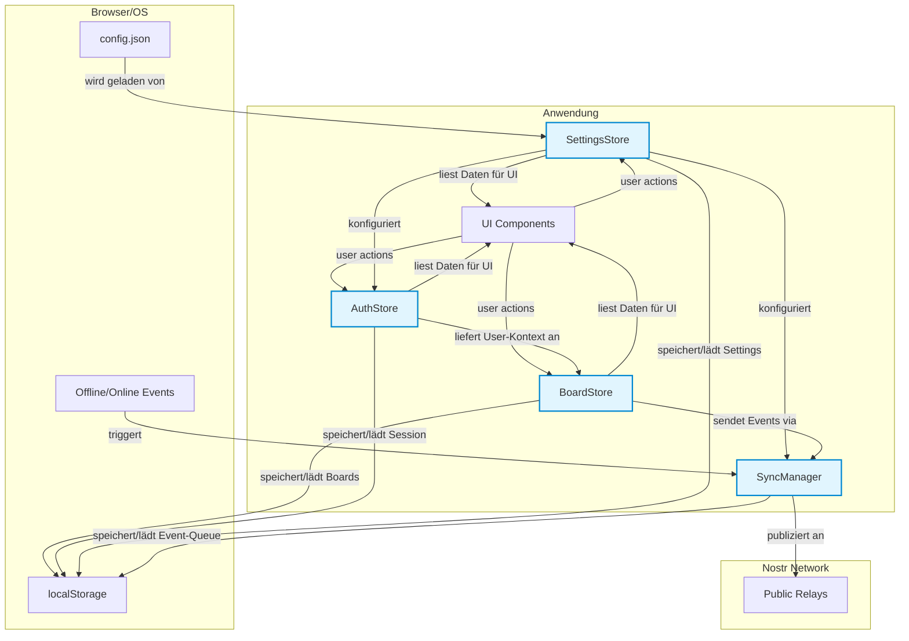

# Store-Architektur: Übersicht & Prinzipien

**Verzeichnis:** `docs/ARCHITECTURE/STORES/`  
**Letztes Update:** 06. November 2025  
**Status:** ✅ **AKTUELL** - Zentrale Dokumentation aller Stores

---

## 🎯 Kernprinzipien der Store-Architektur

Unsere Store-Architektur basiert auf drei fundamentalen Prinzipien, die Konsistenz, Wartbarkeit und Performance sicherstellen.

1.  **Klassen-basierte Stores mit Svelte 5 Runes:**
    - Jeder Store ist eine TypeScript-Klasse, die als Singleton exportiert wird.
    - Interne Zustände werden mit `$state()` verwaltet, abgeleitete Daten mit `$derived.by()`.
    - Dies kapselt die Logik und macht die API klar und testbar.

2.  **Manuelle Persistierung für komplexe Stores:**
    - Wir nutzen bewusst **NICHT** `svelte-persisted-store` für komplexe Stores wie `BoardStore` oder `SettingsStore`.
    - **Grund:** Wir benötigen volle Kontrolle über die Serialisierung (Klassen → JSON), dynamische `localStorage`-Keys und asynchrone Initialisierung (z.B. Laden von `config.json`).
    - **Siehe:** [`GUIDES/STORE-PATTERNS.md`](../../GUIDES/STORE-PATTERNS.md) für eine detaillierte Entscheidungshilfe.

3.  **Zentraler `triggerUpdate()`-Mechanismus:**
    - Jede Zustandsänderung, die persistiert werden muss, ruft intern `triggerUpdate()` auf.
    - Diese Methode inkrementiert einen `$state`-Zähler, der wiederum alle `$derived`-Werte neu berechnen lässt und die `saveToStorage()`-Methode auslöst.
    - Dies garantiert, dass die UI immer synchron mit dem `localStorage` ist.

---

## 🗺️ Store-Interaktionsdiagramm

Dieses Diagramm zeigt, wie die zentralen Stores miteinander kommunizieren und welche externen Abhängigkeiten bestehen.



---

## 📚 Verzeichnis der Stores

### Implementierte Stores

| Store | Datei | Status | Kurzbeschreibung | Dokumentation |
|:---|:---|:---:|:---|:---|
| **BoardStore** | `kanbanStore.svelte.ts` | ✅ Aktiv | Single Source of Truth für alle Board-Daten. Verwaltet CRUD, Persistierung und UI-Daten. | [BOARDSTORE.md](./BOARDSTORE.md) |
| **AuthStore** | `authStore.svelte.ts` | ✅ Aktiv | Verwaltet Benutzerauthentifizierung (NIP-07, nsec) und Session-Management. | [AUTHSTORE.md](./AUTHSTORE.md) |
| **SettingsStore** | `settingsStore.svelte.ts` | ✅ Aktiv | Lädt und merged `config.json` mit User-Settings. Konfiguriert Relays, Theme, LLM. | [SETTINGSSTORE.md](./SETTINGSSTORE.md) |
| **SyncManager** | `syncManager.ts` | ✅ Aktiv | Offline-First Event-Queue mit Retry-Logik. Nutzt `localStorage` für die Queue. | [SYNCMANAGER.md](./SYNCMANAGER.md) |

### Zukünftige / Geplante Stores

| Store | Status | Phase | Beschreibung | Dokumentation |
|:---|:---:|:---:|:---|:---|
| **ChatStore** | ⏳ Geplant | 3.1 | Speichert Konversationsverläufe pro Board. | [CHATSTORE.md](./CHATSTORE.md) |
| **BaseStores** | 🔮 Konzept | 1.6+ | Abstrakte Basisklassen (`BaseSimpleStore`, `BaseComplexStore`) zur Reduzierung von Boilerplate-Code in zukünftigen, einfachen Stores. | [BASESTORES.md](./BASESTORES.md) |
| **AgentStore** | ⏳ Geplant | 3.2 | Verwaltet KI-Agenten, ihre Fähigkeiten und Aktionen. | `AGENTSTORE.md` |

---

## 🚀 Initialisierungs-Reihenfolge (KRITISCH!)

Die korrekte Initialisierung der Stores in `+layout.svelte` ist entscheidend für die Stabilität der Anwendung.

```typescript
// In +layout.svelte -> onMount

// 1. SettingsStore: Lädt config.json und User-Settings aus localStorage.
await settingsStore.loadAndCacheConfig();

// 2. NDK: Wird mit den Relays aus dem SettingsStore initialisiert.
const ndk = new NDK({ explicitRelayUrls: settingsStore.getRelayUrls() });
await ndk.connect();

// 3. AuthStore: Initialisiert die User-Session. Benötigt NDK und Config-Daten.
const authStore = initializeAuth(ndk);
await authStore.restoreSession();

// 4. BoardStore: Benötigt den AuthStore zur Autorisierung von Aktionen.
// (Wird als globaler Singleton importiert, keine explizite Initialisierung nötig)

// 5. SyncManager: Benötigt NDK für Publishing.
const syncManager = new SyncManager(ndk);
boardStore.setSyncManager(syncManager); // Abhängigkeit injizieren
```

**Regel:** Diese Reihenfolge ist **nicht verhandelbar**. Änderungen führen zu Race Conditions und undefiniertem Verhalten.

---

## 🛠️ Debugging & Werkzeuge

Für das Debugging der Stores stehen in der Browser-Konsole globale Instanzen zur Verfügung (im Dev-Modus):

```javascript
// BoardStore API
window.boardStore.data // Aktuelles Board-Objekt
window.boardStore.uiData // Für die UI aufbereitete Daten
window.boardStore.getAllBoards() // Liste aller verfügbaren Boards

// AuthStore API
window.authStore.currentUser // Aktueller NDKUser
window.authStore.getPubkey()
window.authStore.isAuthenticated

// SettingsStore API
window.settingsStore.settings // Aktuelles Einstellungs-Objekt
window.settingsStore.getRelayUrls() // Kombinierte Relay-Liste

// SyncManager API
window.syncManager.status // { isOnline, isSyncing, queueSize }
```

---

## 🔗 Verwandte Dokumente

- **[GUIDES/STORE-PATTERNS.md](../../GUIDES/STORE-PATTERNS.md)**: Wann `persisted()` vs. manuelle Speicherung verwenden?
- **[ARCHITECTURE/REACTIVITY.md](../REACTIVITY.md)**: Wie Svelte 5 Runes in den Stores genutzt werden.
- **[ARCHITECTURE/NOSTR/EVENT-HANDLING-AND-SYNC.md](../NOSTR/EVENT-HANDLING-AND-SYNC.md)**: Wie der `SyncManager` mit Nostr interagiert.
